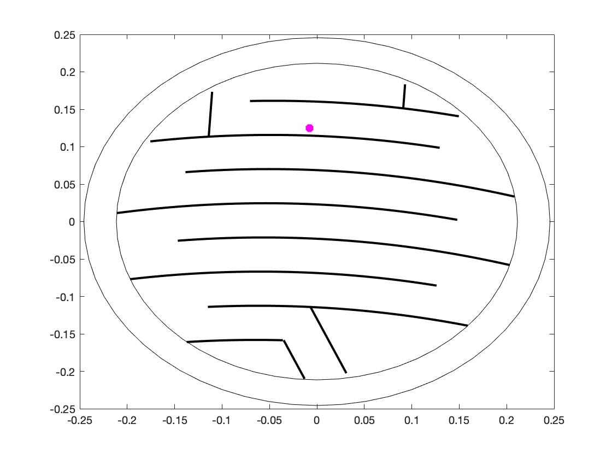

# ¿Qué es Monza?
Monza es una máquina recreativa creada en España y comercializada a partir del año 1979. Para jugar a este juego arcade es necesario introducir una moneda de 5 pesetas (aproximadamente como una moneda de 50 céntimos) por la ranura que se encuentra en la parte superior de la máquina. La moneda cae desde la ranura hasta la plataforma circular que recrea un circuito de coches. El circuito se compone de parábolas alternadas sobre las que se desplaza la moneda, cayendo de un riel a otro cambiando de dirección. En la parte delantera de la máquina existe un volante cuyo giro es solidario al de la plataforma circular del circuito. Para ganar el juego es necesario lograr mediante giros del volante que la moneda salga por la parte inferior del circuito. Si se supera el recorrido se recupera la moneda introducida, pero si la moneda cae por los laterales del circuito se la queda la máquina.  
 
Póster original del juego Monza (1979):  

Los archivos contenidos en este repositorio son una simulación del juego Monza. Para ejecutar la simulación es necesario descargar todos los archivos del repositorio y seleccionar la carpeta que contiene los ficheros descargados como *current folder* en Matlab. Existen 4 niveles de dificultad del juego, cuanto mayor sea el nivel de dificultad de mayor longitud serán las parábolas que definen cada riel de la plataforma. El nivel de dificultad se puede definir en el archivo Monza.slx asignando un valor al bloque constante llamado "dificultad". El control de la moneda se consigue a través de un controlador borroso, se han incluido los ficheros .fis de 3 controladores borrosos. El controlador *fuzzy4* resuelve todos los niveles de dificultad, los otros dos controladores permiten un control más laxo cuando el nivel de dificultad es sencillo. En el bloque *Fuzzy Logic Controller* se puede definir el controlador que se quiere utilizar. Para visualizar la simulación del juego hay que ejecutar el archivo Monza.slx o el archivo plataformaMonza.m si se desea la simulación gráfica de la plataforma.

Representación gráfica del juego Monza:  

# Enlaces a YouTube
En este vídeo se puede ver la simulación del nivel 1 del juego Monza:  
https://www.youtube.com/watch?v=e8ZcW-Klup4&pbjreload=101
